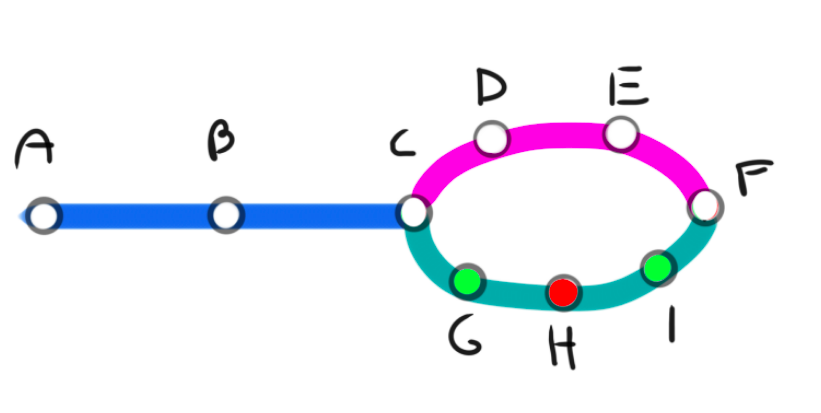
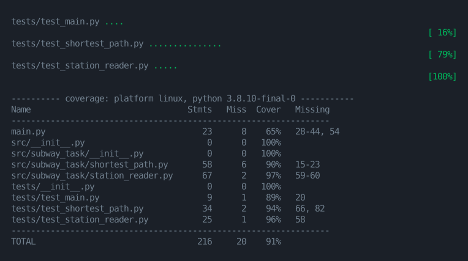

# Tarea Buda.com - Metro

[](https://github.com/FabianVegaA/subway_task/actions/workflows/test.yml)

- [Tarea Buda.com - Metro](#tarea-budacom---metro)
  - [Introducción](#introducción)
  - [Instrucciones](#instrucciones)
    - [Estructurar del archivo de entrada](#estructurar-del-archivo-de-entrada)
    - [Ejecución del programa](#ejecución-del-programa)
  - [Detalles de la implementación](#detalles-de-la-implementación)
  - [Herramientas utilizadas](#herramientas-utilizadas)
  - [Testing](#testing)
  - [Conclusiones](#conclusiones)

## Introducción

El proyecto conciste en un programa capaz de encontrar la ruta más corta entre dos puntos en un mapa de una red de metro.

Exiten 3 tipos de estaciones contemplados inicialmente, pero pueden añadirse más. Las estaciones se pueden asociar con un color (Rojo o Verde), estas indican que un tren exprés Verde pasará solo por estaciones sin color o Verdes, y un tren exprés de color Rojo pasará solo por estaciones sin color o Rojas.

Por ejemplo:


Si quisieramos encontrar la ruta más corta entre A y F, las rutas posibles serían:

- Si es un tren exprés Rojo: A -> B -> C -> H -> F
- Si es un tren exprés Verde: A -> B -> C -> D -> E -> F o A -> B -> C -> G -> I -> F
- Si es un tren sin color: A -> B -> C -> D -> E -> F

## Instrucciones

### Estructurar del archivo de entrada

```
#STATIONS
a
b red
c green
#END STATIONS

#ROUTES
a b
b c
c a
#END ROUTES
```

Para las estaciones se debe indicar el nombre de la estación y su color separado por un espacio, en el caso de no tener color, no es necesario añadir algo. Del mismo modo las rutas se deben indicar con los nombres de las estaciones separadas por un espacio.

### Ejecución del programa

Para ejecutar el programa con el archivo de entrada de ejemplo se debe utilizar el siguiente comando:

```shell
python3 main.py source destination filename --verbose
```

> Para agregar el color del tren se debe agregar  `--color <color>`, por defecto el tren es sin color.

Output:

```
La ruta más corta es:
A -> B -> C -> D -> E -> F
Número de pasos: 6
```

## Detalles de la implementación

Para poder resolver el problema, la primera idea fue verlo como un grafo no ponderado ni dirigido. Para recorrer el grafo recordé varios algoritmos que me podrían ayudar entre ellos, como Backtraking, un algoritmo que recorre un árbol en búsqueda de una solución factible y capaz de retroceder en su recorrido, Dijkstra, capaz de encontrar las mínimas distancias entre todos los nodos, y Kruskal, para encontrar MST. Pero el mejor algoritmo para esta tarea es **Breath First Search**, debido a que es un algoritmo que recorre un grafo en búsqueda del camino más corto entre 2 nodos.

Además de encontrar un buen algoritmo que me ayudara en la solución, necesitaba una estructura que almacenara los nodos y vértices. Para ello lo más sencillo fue almacenar los nodos en un diccionario, donde el nombre es la llave y dentro posee una instancia de la clase Station, que a su vez almacena el color de la estación y su nombre, para hacer fácil su manipulación. Para los vértices decanté por algo sencillo, una lista de tuplas con el nombre de ambos vértices.

Uno de los mayores desafios fue desarrollar el programa que entregara los vecinos de un nodo según el color del tren, pues si el tren es verde y los nodos vecinos son blancos y rojo, el tren puede ir a los nodos blancos, pero no a los rojos. Para solucionar eso desarrollé este método:

```Python
def neighbor_stations(
    self, curr_st: Station, type_train: str
) -> Generator[Station, None, None]:
    ...

    queue: List[Station] = [curr_st]
    visited: Set[str] = {curr_st.name}

    while len(queue) > 0:
        st: Station = queue.pop(0)

        for neighbor in self._get_neighbors(st):
            if neighbor.name not in visited:
                if (
                    type_train != ""
                    and neighbor.type != ""
                    and neighbor.type != type_train
                ):
                    queue.append(neighbor)
                else:
                    visited.add(neighbor.name)
                    yield neighbor
```

El cual se aprovecha de una cola para poder encontrar una solución iterativa sin necesidad de recurrir a la recursividad. En resumen, busca vecinos propios y los vecinos de los nodos vecinos del color diferente al del tren. Como adición, hice que la función fuese un generador, para aprovechar de ocupar la menor cantidad de recursos a la vez.

## Herramientas utilizadas

Para el desarrollo del programa se utilizaron las siguientes herramientas:

- mypy: Para la validación de tipos de datos
- black: Para el correcto formateo  del código
- isort: Para organizar los imports
- flake8: Para la linting de código
- pytest: Para la ejecución de tests

Estos se implemtaron utilizando Pre-commit, lo que permite el despliegue de los cambios con un correcto formatting, linting y testing.

Adicionalmente se implementó la automatización de los tests utilizando GitHub Action en el proyecto.

## Testing

Como metodología base del desarrollo utilicé Test-Driven Development, de este modo se asegura un buen funcionamiento de cada implementación, y a su vez que el programa funcione correctamente.

Aquí un screenshot del reporte que entrega Pytest:



## Conclusiones

Este proyecto fue muy satisfactorio, pues me permitió utilizar mis conocimientos sobre algoritmos y estructuras de datos, a su vez con técnicas de desarrollo de software como TDD, y mis conocimientos de Python.
